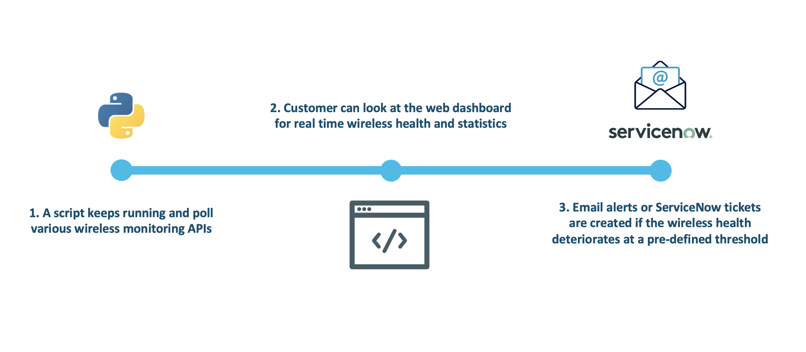
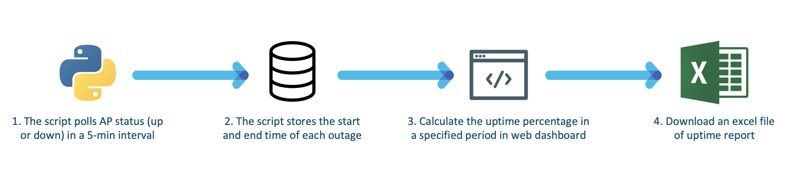
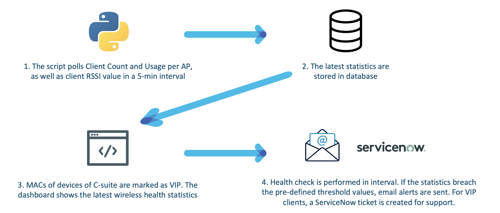

# Meraki Wireless Visibility Dashboard

A consolidated dashboard that pulls and displays data from various Meraki monitoring APIs. If the wireless health drops to a pre-defined threshold value, email alerts or ServiceNow tickets are created.

---

The following diagram describes the use case overview.



The following diagram describes the PoV high level design.






## Contacts
* Alvin Lau (alvlau@cisco.com)
* Felix H Y Lam (flam1@cisco.com)
* Parag Mehunkar (pmehunka@cisco.com)


## Solution Components
* Meraki MR
* Python 3.7


## Prerequisite
- **Meraki - Enable API Access** - enable API and get API key in Meraki Dashboard.
  1. Login to Meraki Dashboard.
  2. Go to "Organization" -> "Settings".
  3. Scroll down to the bottom and check "Enable access to the Cisco Meraki Dashboard API", then click "Save Changes".
  4. Click your email at the top right corner -> "My profile".
  5. Click "Generate new API key", copy your API key in the pop-up window, check the box and click "Done".
  6. Paste and keep the API key in a safe location.

- **SMTP Server**
  You may set up your own SMTP server or any provided service. In this prototype, Gmail is used. Please check [here](https://realpython.com/python-send-email/) for instruction.

- **ServiceNow**
  If you do not have ServiceNow, you can request an instance from [ServiceNow Developer Program](https://signon.service-now.com/ssoregister.do?redirectUri=https://servicenowsignon.okta.com/app/template_saml_2_0/k317zlfESMUHAFZFXMVB/sso/saml).  


## Installation

1. Clone this repository by `git clone <this repo>`.

2. Optionally, create a Python 3 virtual environment.
```
python3 -m venv venv
source venv/bin/activate
```

3. Install the dependencies.
```
pip install -r requirement.txt
```

4. Run the Flask application.
```
export FLASK_APP=app.py
flask run
```

5. Access the dashboard at http://localhost:5000.


## Run in Docker

1. Clone this repository by `git clone <this repo>`.

2. Go to the root directory containing Dockerfile.

3. Build the container.
```
docker build -t meraki-wireless-visibility-dashboard .
```

4. Run the container.
```
docker run -d -p 5000:5000 meraki-wireless-visibility-dashboard
```

5. Access the dashboard at http://localhost:5000.


## License
Provided under Cisco Sample Code License, for details see [LICENSE](./LICENSE)


## Code of Conduct
Our code of conduct is available [here](./CODE_OF_CONDUCT.md)


## Contributing
See our contributing guidelines [here](./CONTRIBUTING.md)
